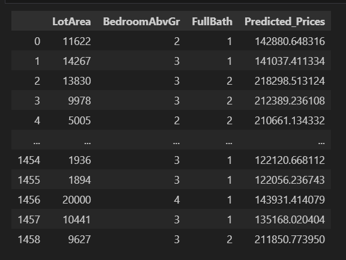

# House Price Prediction using Linear Regression

# Overview 

This repository demonstrates a complete workflow for predicting house prices using a Linear Regression algorithm in Python. 
The process is documented in a Jupyter notebook and encompasses all typical steps of a supervised machine learning project: 
data loading, visualization, preprocessing, model training, evaluation, and prediction on test data.

# Project Structure

Task_01_main.ipynb: Main notebook for the project.

HousePriceDataset_train.csv: Training data (contains house features and sale prices).

HousePriceDataset_test.csv: Test data (features only, used for predicting prices).

# Workflow Details

1. Import Required Libraries
   
pandas, numpy: Data handling and numerical operations.

seaborn, matplotlib: Data visualization.

scikit-learn: Model building, data partitioning, and evaluation metrics.

pickle: Saving trained model for future use.

2. Load Dataset

Loads separate CSV files for training and testing data.

Training data includes the target column SalePrice; test data does not.

3. Data Overview and Visualization

Displays the first few rows and columns to give an overview of dataset structure (80+ features).

Inspects missing values and basic statistics.

Visualizes key relationships, such as correlations to the target variable.

4. Data Preprocessing

Handles missing values appropriately (may drop or fill as needed).

Encodes categorical variables for modeling.

Splits training data into features (X) and target (y), and further into train/validation sets.

5. Model Building

Constructs a Linear Regression model using scikit-learn.

Trains the model on training features.

Evaluates model performance using the validation set.

6. Model Evaluation Metrics

Mean Absolute Error (MAE): Measures average magnitude of errors.

Root Mean Squared Error (RMSE): Penalizes larger errors more strongly.

R² Score: Indicates goodness of fit (closer to 1 is better).

7. Predictions on Test Data

Applies the trained model to test features.

Saves predictions as a new column (Predicted_Prices) in the test set.

8. Results and Output

Final test data includes columns for predicted prices alongside major features like LotArea, BedroomAbvGr, and FullBath.

Results can be exported for further analysis or submission.

9. Model Saving

The notebook uses pickle to serialize and save trained models for reuse without retraining.

# Output

# Key Features

Supports more than 80 house features, capturing diverse property details (zone, lot size, street/alley type, shape of land,
utilities, pool and fence details, sale type, and condition).

Flexible for extension: You can experiment with feature engineering, advanced regression models, or hyperparameter tuning.

# How to Run

Clone or download this repository.

Make sure Task_01_main.ipynb and both CSV files are in the same directory.

Open the notebook in Jupyter and run each cell sequentially.

Check outputs for model performance and final predictions.

# Requirements

Python 3.x

pandas

numpy

seaborn

matplotlib

scikit-learn
